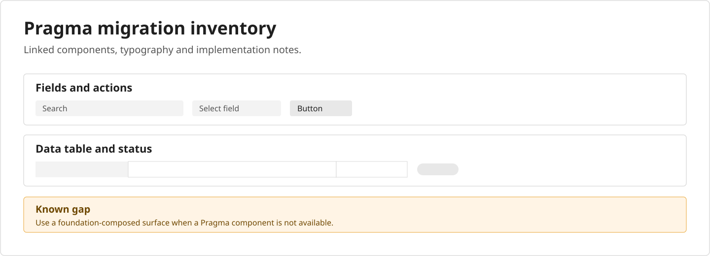
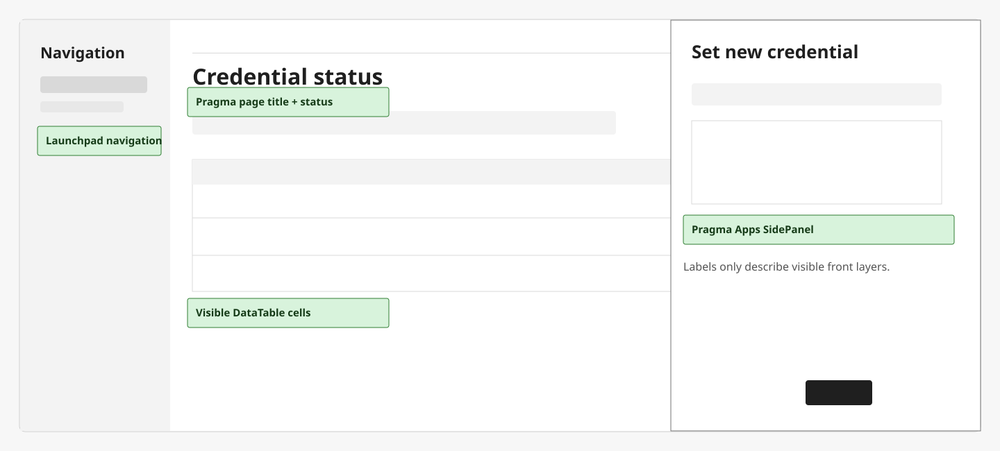

# Pragma Figma Audit Overlay

Turn a legacy Figma frame into a linked Pragma inventory and a readable,
toggleable migration map.





## Try it

Copy [`.github/skills/pragma-figma-audit-overlay`](.github/skills/pragma-figma-audit-overlay)
into the same path in your repository, then ask your agent:

```text
/pragma-figma-audit-overlay <Figma frame URL>
```

## Prerequisites

- A [skills-compatible agent](https://code.visualstudio.com/docs/copilot/customization/agent-skills).
- The [Figma remote MCP server](https://developers.figma.com/docs/figma-mcp-server/remote-server-installation/) connected with write access to the file.
- Access to your Pragma and application Figma libraries.

### Install Pragma MCP

Recommended ([install Bun](https://bun.sh/)):

```bash
bun i -g @canonical/pragma-cli
pragma setup
```

Or use [npm](https://www.npmjs.com/package/@canonical/pragma-cli):

```bash
npm i -g @canonical/pragma-cli
pragma setup
```

`pragma setup` detects supported agent harnesses. Open a new agent chat, then
ask: `Using Pragma, how many components are in the graph?`

See [Canonical Pragma](https://github.com/canonical/pragma) for supported
harnesses and setup details. VS Code and VSCodium support is experimental.

The skill uses Pragma tools for the migration decisions and Figma MCP for canvas
writes. It preserves the source frame, inventories linked replacements, and adds
one toggleable annotation layer only for visible front-layer elements.

Before it writes, the skill checks Pragma access, Figma MCP read/write workflow
availability, source-frame access, and the required linked libraries.

## License

[MIT](LICENSE)